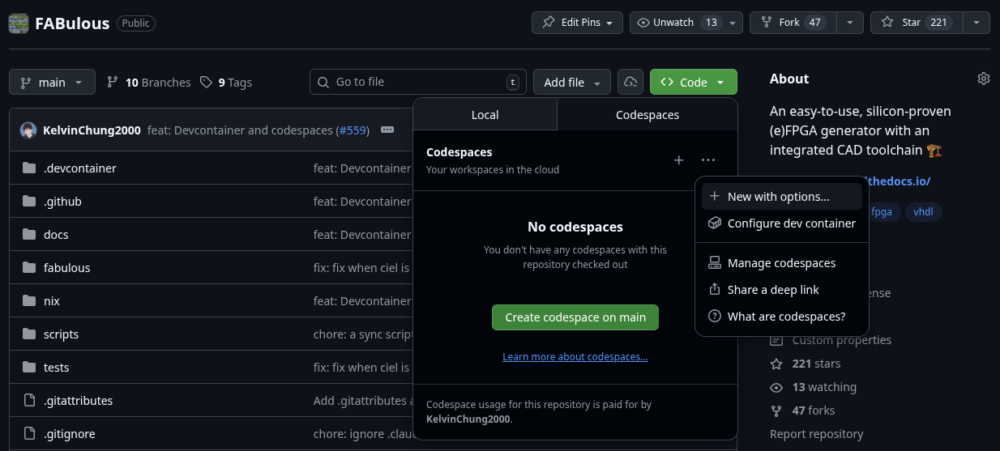
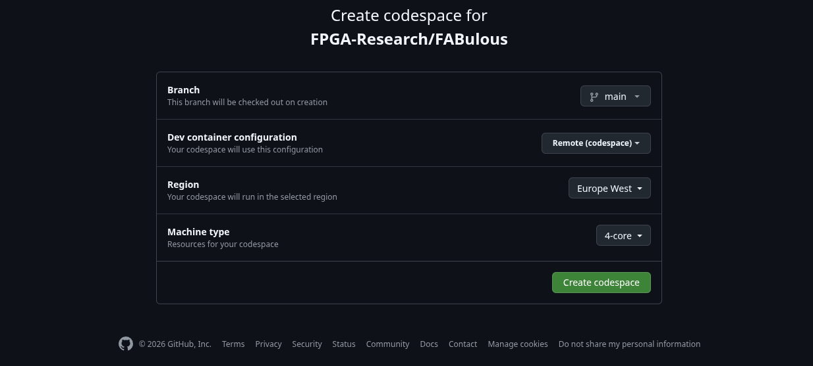
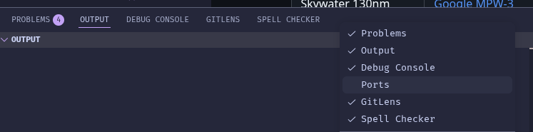
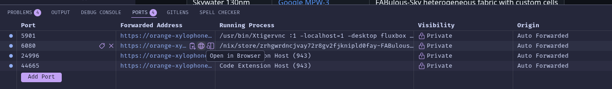
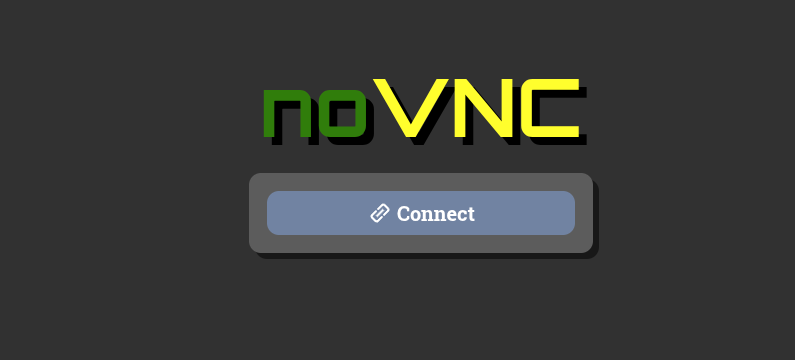
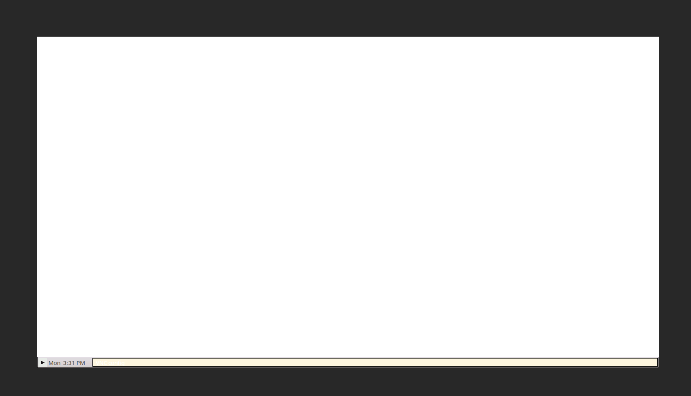
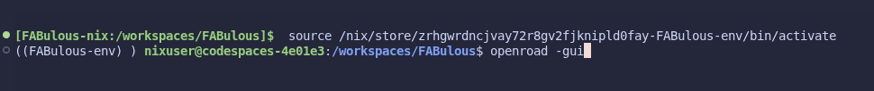
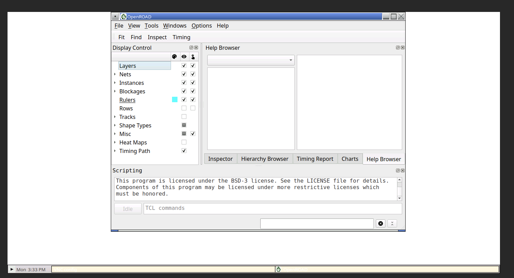

(codespaces-guide)=
# Using FABulous in GitHub Codespaces

GitHub Codespaces provides a complete, cloud-based development environment for FABulous with full GUI support through a web browser. This eliminates the need for local installation and works on any platform.

## Quick Start
1. Navigate to the [FABulous repository](https://github.com/FPGA-Research/FABulous) on GitHub
2. Click the green **"Code"** button
3. Select the **"Codespaces"** tab

When creating a Codespace, make sure to select the correct dev container configuration:




GitHub will automatically create and configure your development environment. The setup process will take a while.
```{note}
If you don't see the configuration options, you can change them after creation by rebuilding the container.
```

## Accessing GUI Applications

FABulous includes tools like OpenROAD that have graphical interfaces. In Codespaces, these are accessible through a web-based VNC viewer.

### Opening the GUI

1. In the **Ports** tab, find port **6080**, if the port does not exist click **"Add Port"** and add port **6080**.


2. Click the port entry to open it in a browser tab and you should see the following screen, click connect and should bring you to a white window.




3. You should now see the desktop where FABulous GUI apps can open.




## Running FABulous

Once your Codespace is ready, FABulous is pre-installed and ready to use. Open a terminal and verify:

```bash
fabulous --version
```

### Creating a Project

```bash
fabulous create-project my_project
cd my_project
fabulous start
```

Inside the FABulous shell:

```bash
fabulous>run_FABulous_fabric
fabulous>run_FABulous_bitstream user_design/sequential_16bit_en.v
```

### Using GUI Tools

To use GUI tools like OpenROAD:

1. Make sure port 6080 is forwarded (see above)
2. Open the VNC viewer in your browser
3. Run your GUI command in the terminal:

```bash
openroad -gui
```

The GUI will appear in the VNC browser window.

## Tips and Troubleshooting

### Performance

- Codespaces provides 2-4 CPU cores and 8GB RAM by default
- For larger designs, you may want to upgrade to a more powerful machine type
- Go to **Settings → Machine type** to change the configuration

### Persistence

- Your workspace files are automatically saved
- Codespaces automatically suspend after 30 minutes of inactivity
- Stopped Codespaces are deleted after 30 days of inactivity by default

### Running Out of Space

If you encounter disk space issues:

```bash
# Check disk usage
df -h

# Clean up Docker resources
docker system prune -a

# Clean Python caches
find . -type d -name __pycache__ -exec rm -r {} +
find . -type f -name "*.pyc" -delete
```

### GUI Not Appearing

If GUI applications don't show up in the VNC viewer:

1. Verify port 6080 is forwarded in the Ports tab
2. Check the terminal for any error messages
3. Ensure DISPLAY is set correctly:

```bash
echo $DISPLAY  # Should show :1
```

4. Restart the VNC service if needed:

```bash
sudo systemctl restart x11vnc
```

## Advantages of Codespaces

- **No Local Installation**: Everything runs in the cloud
- **Cross-Platform**: Works on Windows, macOS, Linux, tablets
- **Consistent Environment**: Same setup for all users
- **Powerful Hardware**: Access to cloud computing resources
- **GUI Support**: Full graphical tools via web browser
- **Free Tier**: GitHub provides 60 hours/month free for personal accounts

## Differences from Local Setup

| Feature | Codespaces | Local Dev Container |
|---------|------------|---------------------|
| Installation | None required | Docker + VS Code |
| GUI Method | Web-based VNC (port 6080) | Native X11 forwarding |
| Performance | Cloud resources | Local hardware |
| Cost | Free tier then paid | Free (uses local resources) |
| Offline Work | No | Yes |

## Next Steps

Once your Codespace is set up, continue with the [Quick Start Guide](#quick-start) to learn how to use FABulous to create FPGA fabrics.
